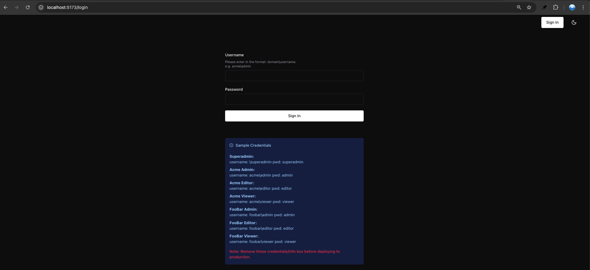
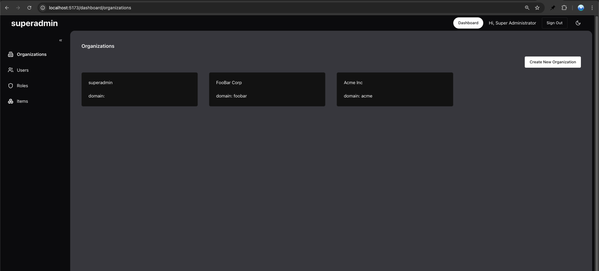
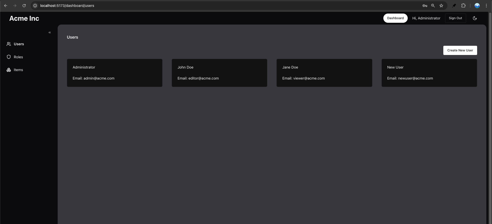
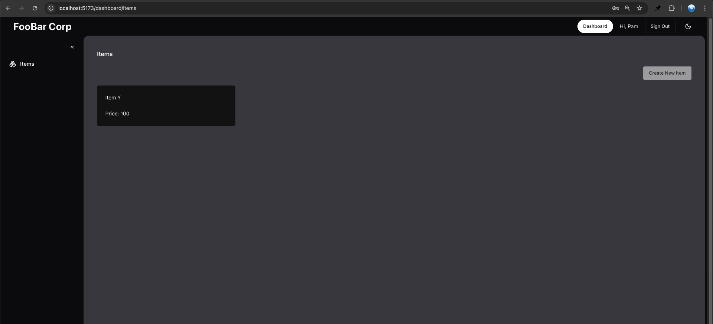

# RBAC Starter Kit

A modern, full-stack starter kit for building applications with **Role-Based Access Control (RBAC)** using FastAPI (Python), React (TypeScript), and PostgreSQL

## Features

- Role-based access control
- Organization-level data isolation (multi-tenancy)
- Secure JWT authentication
- Granular permission system
- Assign permissions to roles and roles to users
- RESTful API with FastAPI
- Modern React frontend (TanStack Router, Chakra UI, React Query)
- PostgreSQL database with SQLAlchemy ORM
- Example seed script for demo data
- Ready for extension and production 
- Comprehensive API documentation with Swagger UI

## Installation
-  **Clone the repo**
    ```bash
    git clone https://github.com/vineetsarpal/rbac-starterkit
    ```

### Backend

1. **Install dependecies**
    ```bash
    cd rbac-starterkit/backend
    python3 -m venv venv
    source venv/bin/activate
    pip install -r requirements.txt
    ```
2. **Set up Postgres**
    - Create a postgres instance locally or by using a managed service
    - Get the DB connection URL

3. **Configure environment**
    - Create a `.env` and copy the contents of `.env.example`
    - Set your secrets and DB connection URL


4. **Run the script to seed data**
    ```bash
    python3 scripts/seed_reset_db.py
    ```

5. **Start the API**
    ```bash
    fastapi dev src/main.py
    ```

### Frontend

1. **Install dependencies**
    ```bash
    cd ../frontend
    npm install
    ```

2. **Start the App**
    ```bash
    npm run dev
    ```

### API Docs

Once running, visit [http://localhost:8000/docs](http://localhost:8000/docs) for interactive API documentation


## Using the Application

### App Screenshots

**Login Page**


**Superadmin Dashboard**


**Admin Dashboard**


**Viewer Dashboard**


### Authentication
After starting both frontend and backend, visit `http://localhost:5173` to access the login page. The seed script creates several test users with different roles:

| Role | Username | Password | Description |
|------|----------|----------|-------------|
| Superadmin | \superadmin | superadmin | Full system access |
| Acme Admin | acme\admin | admin | Admin access for Acme org |
| Acme Editor | acme\editor | editor | Edit access for Acme org |
| Acme Viewer | acme\viewer | viewer | View access for Acme org |
| FooBar Admin | foobar\admin | admin | Admin access for FooBar org |
| FooBar Editor | foobar\editor | editor | Edit access for FooBar org |
| FooBar Viewer | foobar\viewer | viewer | View access for FooBar org |

### Role Hierarchy & Permissions

1. **Organization-level separation**
   - Users can only access data within their organization
   - Superadmin can access all organizations

2. **Default Role Capabilities**
   
   **Admin**
   - Full access within their organization
   - Manage users (create, update, delete)
   - Assign roles to users
   - Manage role permissions
   - All Editor and Viewer capabilities
   
   **Editor**
   - Create new items
   - Edit existing items
   - Delete items
   - All Viewer capabilities
   
   **Viewer**
   - View items

3. **Permission Examples**
   ```
   # Admin-level Permissions
   create:users     - Create new users
   update:users     - Modify user details
   delete:users     - Remove users
   update:roles     - Modify role permissions
   
   # Editor-level Permissions
   create:items     - Create new items
   update:items     - Modify items
   delete:items     - Remove items
   
   # Viewer-level Permissions
   read:items       - View item details
   ```

Note: These permissions are configurable. The above represents the default setup provided by the seed script.


## Usage Scenarios

### Simple Application
For a basic application with simple RBAC needs:
- Use the pre-configured roles (Admin, Editor, Viewer)
- Stick to organization-level separation
- Use the existing permission structure
- Remove unused features from the UI
- Keep the default user management flows

### Production Application
For a production-ready system:
- Implement custom roles and permissions based on your business logic
- Add additional security measures:
  - Rate limiting
  - Password policies
  - MFA (Multi-Factor Authentication)
- Set up proper logging and monitoring
- Use a production-grade PostgreSQL setup
- Set up proper CI/CD pipelines